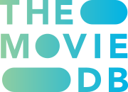

# [Movies Browser using TypeScript and ReactQuery](https://kaniewskisoftware.github.io/movies-browser-ts-rq/)

This project is an alternative version of my group project, [MoviesBrowser](https://kaniewskisoftware.github.io/movie-browser/). The primary goal is to refactor the entire project using TypeScript to create a more professional codebase. Instead of using Redux to manage the state of the app, I will utilize ReactQuery. Additionally, I will strive to make the code as generic as possible by creating simpler, reusable components. I have also developed custom hooks and utilities to achieve various functionalities, such as handling different image sizes based on screen width and managing screen resizing.

The project now boasts a well-structured and organized codebase, thanks to the reusable and generic components that have been constantly improved upon. With a strong foundation in place, future enhancements and features can be easily integrated.

## Main Goals

- Refactor the whole project using TypeScript to make the code more professional
- Manage the state of the app using ReactQuery instead of Redux
- Make the code as generic as possible by creating simpler, reusable components
- Create custom hooks and utilities for various purposes
- Enhance search functionality with debouncing for improved performance and user experience

## Next Steps

Upcoming tasks and goals include:

1. Break down the Tile component
   - Create a subcomponent to handle role and release date logic
2. Improve the Tags component to be more generic
3. Write comprehensive Jest tests for the codebase to ensure its reliability and maintainability
4. Add detailed documentation for components, hooks, and utilities to make it easier for others to understand and contribute to the project
5. Develop a generic DetailsPage that leverages the existing Tile component used for both People and Movies pages, with appropriate conditional variables for seamless integration
6. Better organize and improve the styling of the project for a more polished look and feel
7. Continuously identify and fix bugs to ensure a smooth and reliable user experience

By accomplishing these goals, the project will continue to evolve and provide a robust, maintainable, and user-friendly experience.

## Movies Browser

This site allows you to browse the most popular movies and actors from the public tmdb API. You can also get to know each of the above better on the details pages. There is a search engine in the upper right corner. It searches for movies or actors depending on which subpage you are currently on. Layout was designed in Figma by professionalist.

<!-- ## Preview

 -->

## API Source

## Technologies

- React
- JavaScript: ES6+
- TypeScript
- CSS Grid
- CSS Flexbox
- Responsive Web Design
- React Router
- API (fetch, Axios, AxiosInstance)
- ReactQuery
- NPM
- React Hooks
- Custom Hooks
- Error Handling
- Figma
- Trello
- React app
- Conditional Types
- Utility Functions
- Debouncing
- Markdown (for the README documentation)

## Available Scripts

In the project directory, you can run:

### `npm start`

Runs the app in the development mode.\
Open [http://localhost:3000](http://localhost:3000) to view it in your browser.

The page will reload when you make changes.\
You may also see any lint errors in the console.

### `npm test`

Launches the test runner in the interactive watch mode.\
See the section about [running tests](https://facebook.github.io/create-react-app/docs/running-tests) for more information.

### `npm run build`

Builds the app for production to the `build` folder.\
It correctly bundles React in production mode and optimizes the build for the best performance.

The build is minified and the filenames include the hashes.\
Your app is ready to be deployed!

See the section about [deployment](https://facebook.github.io/create-react-app/docs/deployment) for more information.

### `npm run eject`

**Note: this is a one-way operation. Once you `eject`, you can't go back!**

If you aren't satisfied with the build tool and configuration choices, you can `eject` at any time. This command will remove the single build dependency from your project.

Instead, it will copy all the configuration files and the transitive dependencies (webpack, Babel, ESLint, etc) right into your project so you have full control over them. All of the commands except `eject` will still work, but they will point to the copied scripts so you can tweak them. At this point you're on your own.

You don't have to ever use `eject`. The curated feature set is suitable for small and middle deployments, and you shouldn't feel obligated to use this feature. However we understand that this tool wouldn't be useful if you couldn't customize it when you are ready for it.
